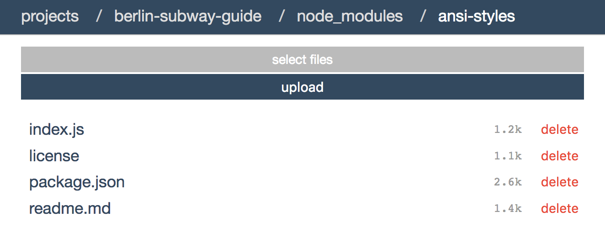

# *casket* ⏱

***casket* is an HTTP server** that supports `GET`, `POST` and `DELETE` requests. It can respond in HTML, JSON and plain text format, **the HTML-version being a file management UI**.



[](https://www.npmjs.com/package/casket)
[](https://travis-ci.org/derhuerst/casket)
[](https://david-dm.org/derhuerst/casket)
[](https://david-dm.org/derhuerst/casket#info=devDependencies)


## Installing

```shell
npm install -g casket
```


## Usage

```
casket [--name my-little-server] [--dir ~/path/to/dir]

Options:
    --name -n The name of the server, as shown in the GUI.
    --dir  -d The directory to serve, default is the current directory.
```


## Contributing

If you **have a question**, **found a bug** or want to **propose a feature**, have a look at [the issues page](https://github.com/derhuerst/casket/issues).
